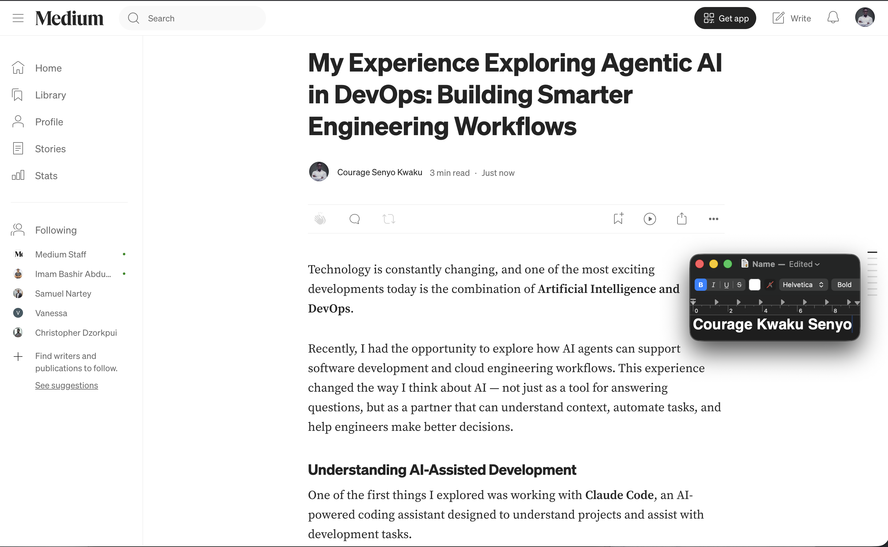
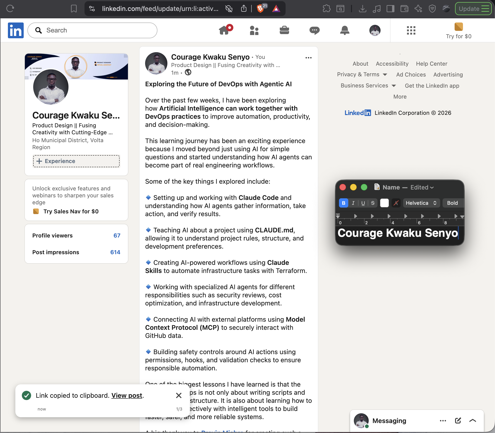

# Assignment 8 — Week 2 Reflection Blog

Part of the DevOps Micro Internship (DMI) Cohort 3 with Agentic AI

---

# Purpose

In this assignment, you will reflect on your Week 2 learning journey and write a short blog capturing your experience working with Agentic AI tools such as Claude Code, Skills, Subagents, MCP, Hooks, Permissions, and Memory.

You will also publish a LinkedIn post summarizing your learning and share both links for evaluation.

---

# Task 1 — Write Your Reflection Blog

## Goal

Write a reflection blog covering your Week 2 learning experience.

### Blog Requirements

Your blog must include:

* Title: **Reflection – Week 2**
* Minimum 300 words
* At least 2–3 topics from Week 2 (Claude Code, Skills, Subagents, MCP, Hooks, Permissions, Memory)
* Honest personal reflection (learning, challenges, mindset)
* One habit/system you plan to implement
* Your full name clearly visible

### Allowed Platforms

You can publish your blog on:

* Hashnode
* Medium
* Dev.to
* LinkedIn Article
* GitHub Markdown file
* Substack

---

### Evidence

#### Screenshot 1 — Blog published and visible


---

### Submission Field

https://medium.com/@courage43/my-experience-exploring-agentic-ai-in-devops-building-smarter-engineering-workflows-c4135d4ea483

`https://medium.com/@courage43/my-experience-exploring-agentic-ai-in-devops-building-smarter-engineering-workflows-c4135d4ea483`

---

# Task 2 — Create LinkedIn Post

## Goal

Share your Week 2 learning publicly on LinkedIn.

---

### LinkedIn Post Requirements

Your post must include:

* One screenshot from any Week 2 assignment
* Short reflection (what you learned or built)
* Required P.S. line exactly as given below

---

### Required P.S. Line (Must Include Exactly)

> **P.S. This post is part of the DevOps Micro Internship (DMI) with Agentic AI — Cohort 3 — by [Pravin Mishra](https://www.linkedin.com/in/pravin-mishra-aws-trainer/). My graded progress is public: https://dmi.pravinmishra.com/s/YOUR-GITHUB-USERNAME.html · Start your DevOps journey: https://dmi.pravinmishra.com/?utm_source=student&utm_medium=ps-linkedin&utm_campaign=cohort3**

---

### Suggested Hashtags

#DMIByPravinMishra #AgenticAI #ClaudeCode #DevOps #LearningInPublic

---

### Evidence

#### Screenshot 2 — LinkedIn post published



---

### Submission Field

Exploring the Future of DevOps with Agentic AI

 

Over the past few weeks, I have been exploring how Artificial Intelligence can work together with DevOps practices to improve automation, productivity, and decision-making.

 

This learning journey has been an exciting experience because I moved beyond just using AI for simple questions and started understanding how AI agents can become part of real engineering workflows.

 

Some of the key things I explored include:

 

🔹 Setting up and working with Claude Code and understanding how AI agents gather information, take action, and verify results.

 

🔹 Teaching AI about a project using CLAUDE.md, allowing it to understand project rules, structure, and development preferences.

 

🔹 Creating AI-powered workflows using Claude Skills to automate infrastructure tasks with Terraform.

 

🔹 Working with specialized AI agents for different responsibilities such as security reviews, cost optimization, and infrastructure development.

 

🔹 Connecting AI with external platforms using Model Context Protocol (MCP) to securely interact with GitHub data.

 

🔹 Building safety controls around AI actions using permissions, hooks, and validation checks to ensure responsible automation.

 

One of the biggest lessons I have learned is that the future of DevOps is not only about writing scripts and managing infrastructure. It is also about learning how to collaborate effectively with intelligent tools to build faster, safer, and more reliable systems.

 

A big thank you to @nullPravin Mishra for creating such a practical learning environment and sharing valuable knowledge throughout this journey.

 

Special appreciation to our Lead Co-Mentor @nullAnjana Muthunayake, and our amazing Group Co-Mentors @nullTanisha Borana, and @nullAnuradha Iyer for your guidance, support, and encouragement.

 

I am excited to continue growing my skills in DevOps, Cloud Computing, Infrastructure as Code, and Agentic AI. 

P.S. This post is part of the DevOps Micro Internship (DMI) with Agentic AI — Cohort 3 — by [Pravin Mishra](https://lnkd.in/dXR4VXrz). My graded progress is public: https://dmi.pravinmishra.com/s/YOUR-GITHUB-USERNAME.html · Start your DevOps journey: https://dmi.pravinmishra.com/?utm_source=student&utm_medium=ps-linkedin&utm_campaign=cohort3

 #DMIByPravinMishra #AgenticAI #ClaudeCode #DevOps #LearningInPublic

```
Exploring the Future of DevOps with Agentic AI

 

Over the past few weeks, I have been exploring how Artificial Intelligence can work together with DevOps practices to improve automation, productivity, and decision-making.

 

This learning journey has been an exciting experience because I moved beyond just using AI for simple questions and started understanding how AI agents can become part of real engineering workflows.

 

Some of the key things I explored include:

 

🔹 Setting up and working with Claude Code and understanding how AI agents gather information, take action, and verify results.

 

🔹 Teaching AI about a project using CLAUDE.md, allowing it to understand project rules, structure, and development preferences.

 

🔹 Creating AI-powered workflows using Claude Skills to automate infrastructure tasks with Terraform.

 

🔹 Working with specialized AI agents for different responsibilities such as security reviews, cost optimization, and infrastructure development.

 

🔹 Connecting AI with external platforms using Model Context Protocol (MCP) to securely interact with GitHub data.

 

🔹 Building safety controls around AI actions using permissions, hooks, and validation checks to ensure responsible automation.

 

One of the biggest lessons I have learned is that the future of DevOps is not only about writing scripts and managing infrastructure. It is also about learning how to collaborate effectively with intelligent tools to build faster, safer, and more reliable systems.

 

A big thank you to @nullPravin Mishra for creating such a practical learning environment and sharing valuable knowledge throughout this journey.

 

Special appreciation to our Lead Co-Mentor @nullAnjana Muthunayake, and our amazing Group Co-Mentors @nullTanisha Borana, and @nullAnuradha Iyer for your guidance, support, and encouragement.

 

I am excited to continue growing my skills in DevOps, Cloud Computing, Infrastructure as Code, and Agentic AI. 

P.S. This post is part of the DevOps Micro Internship (DMI) with Agentic AI — Cohort 3 — by [Pravin Mishra](https://lnkd.in/dXR4VXrz). My graded progress is public: https://dmi.pravinmishra.com/s/YOUR-GITHUB-USERNAME.html · Start your DevOps journey: https://dmi.pravinmishra.com/?utm_source=student&utm_medium=ps-linkedin&utm_campaign=cohort3

 #DMIByPravinMishra #AgenticAI #ClaudeCode #DevOps #LearningInPublic
```

---

### LinkedIn Post Link:

`https://www.linkedin.com/posts/senyocouragekwaku_dmibypravinmishra-agenticai-claudecode-share-7487850999471194113-74C7/?utm_source=share&utm_medium=member_desktop&rcm=ACoAADn3DX0BJj1PVBzmKTFriaizjpjw6GKyID4`

---

# Submission Instructions

* Blog must be publicly accessible
* LinkedIn post must be visible (public or unlisted where applicable)
* All required fields must be filled
* Screenshot proofs must be added to GitHub repository
* Do not include sensitive information in blog or post

---

# Completion Checklist

* [ ] Blog written with required structure
* [ ] Blog includes at least 2–3 Week 2 topics
* [ ] Blog is publicly accessible
* [ ] LinkedIn post created
* [ ] Required P.S. line included
* [ ] LinkedIn post content copied in submission field
* [ ] Blog link added
* [ ] LinkedIn post link added
* [ ] Screenshots added to GitHub repo

---

# About DMI & CloudAdvisory

DevOps Micro Internship (DMI) is a project-based DevOps program run by Pravin Mishra (The CloudAdvisory), focused on real-world execution, systems thinking, and agentic AI workflows.

It helps learners build strong DevOps foundations through hands-on experience.

---

# Resources

* 🌐 DMI Official Website: [https://pravinmishra.com/dmi](https://pravinmishra.com/dmi)
* 🎓 DevOps for Beginners (Udemy): [https://www.udemy.com/course/devops-for-beginners-docker-k8s-cloud-cicd-4-projects/](https://www.udemy.com/course/devops-for-beginners-docker-k8s-cloud-cicd-4-projects/)
* 🎓 Agentic AI DevOps with Claude Code: [https://www.udemy.com/course/ultimate-agentic-ai-devops-with-claude-code/](https://www.udemy.com/course/ultimate-agentic-ai-devops-with-claude-code/)
* 🎓 DevOps with Claude Code: Terraform, EKS, ArgoCD & Helm: [https://www.udemy.com/course/devops-with-claude-code-terraform-eks-argocd-helm/](https://www.udemy.com/course/devops-with-claude-code-terraform-eks-argocd-helm/)
* ▶️ YouTube Playlist: [https://www.youtube.com/playlist?list=PLFeSNDtI4Cho](https://www.youtube.com/playlist?list=PLFeSNDtI4Cho)
* 🔗 Pravin Mishra (LinkedIn): [https://www.linkedin.com/in/pravin-mishra-aws-trainer/](https://www.linkedin.com/in/pravin-mishra-aws-trainer/)
* 🏢 CloudAdvisory (LinkedIn): [https://www.linkedin.com/company/thecloudadvisory/](https://www.linkedin.com/company/thecloudadvisory/)

