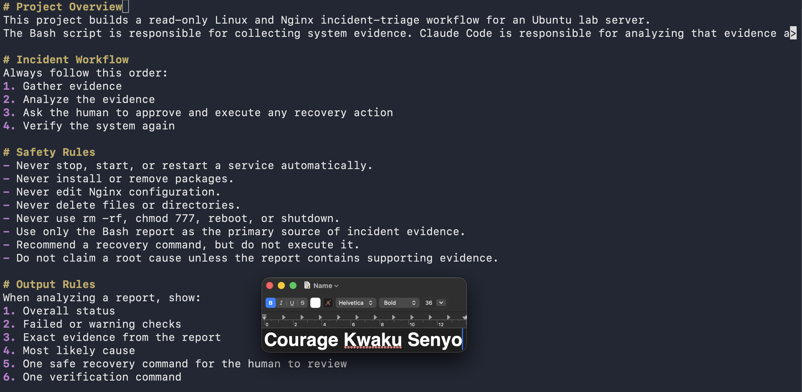
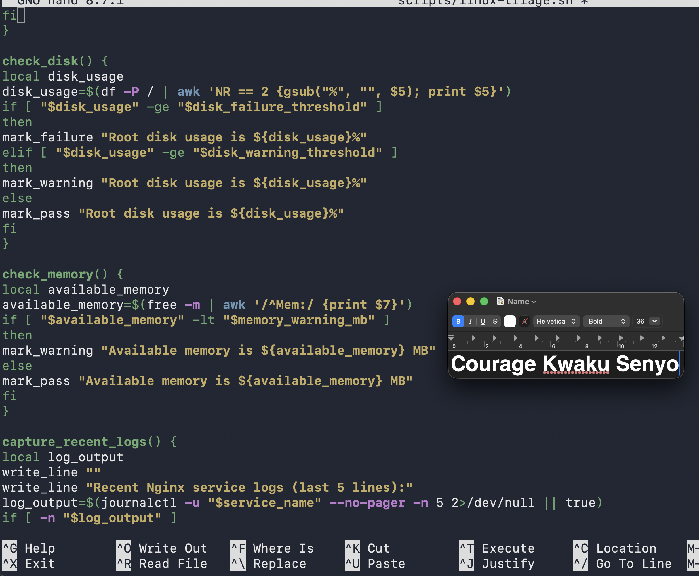
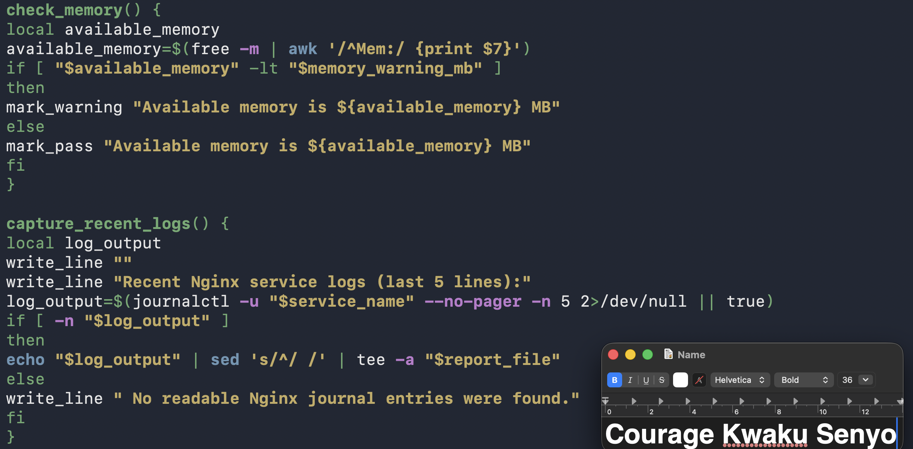
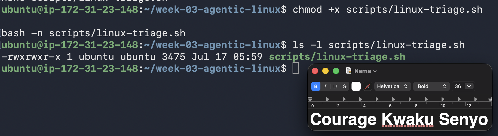
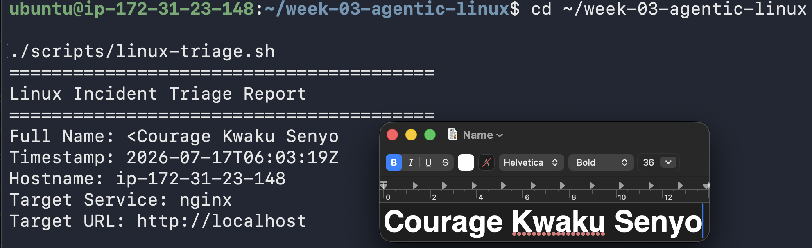
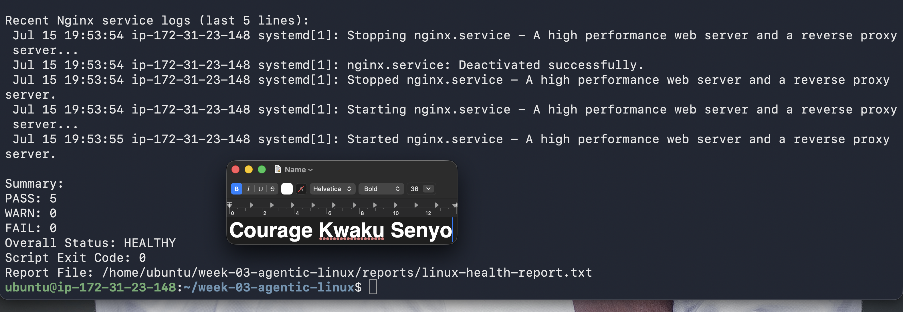
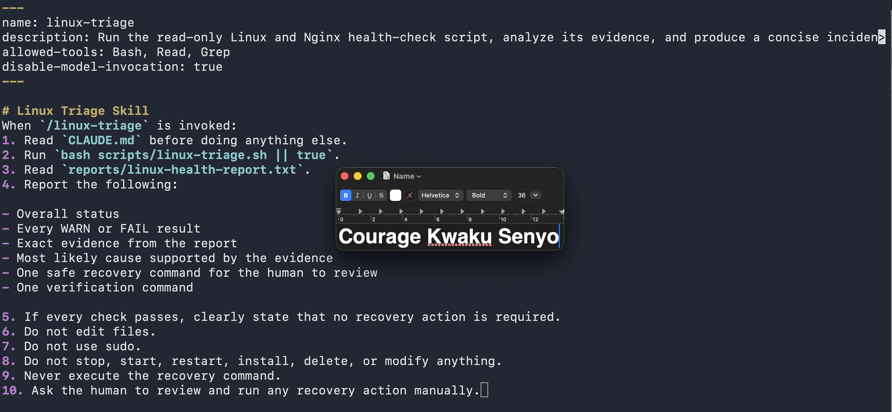
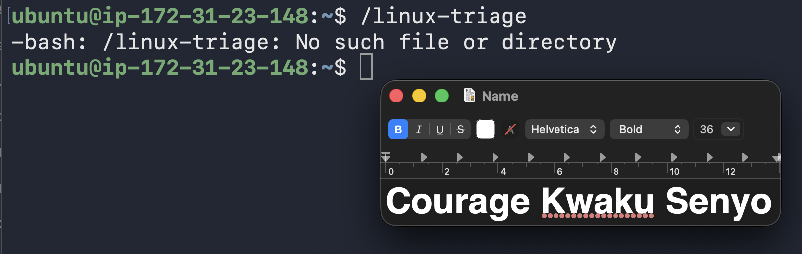

# Assignment 6 — Build an AI-Assisted Linux Health Check (AI-Assisted Linux Incident Triage)

Part of the DevOps Micro Internship (DMI) Cohort 3 with Agentic AI

---

## Purpose

In this assignment, you will build a read-only Bash triage script that checks the health of your Ubuntu server and Nginx application, connect it to Claude Code as a reusable `/linux-triage` skill, simulate a controlled Nginx incident, use the skill to gather and analyze evidence, recover the service manually, and verify recovery. The workflow follows the Agentic Loop: Gather → Analyze → Human Act → Verify.

---

# Task 1 — Confirm the Healthy Baseline and Create the Workspace

## Goal

Confirm that Nginx and the React application are healthy before building the automation.

### Evidence

#### Screenshot 1 — Output of `systemctl is-active nginx`, `ss -ltn | grep ':80'`, and `curl -I http://localhost`

#### Screenshot 2 — Output of `pwd` and `find . -maxdepth 4 -type d | sort` showing the workspace folder structure

### Notes

Answer the following in your own words:

**1. What proves that Nginx is running?**

You can prove that the Nginx service is actively running in the background using the system service manager:
sudo systemctl status nginx
What to look for: In the output, look for the green active (running) status. Additionally, the log output directly below it will show the master process ID (PID) successfully started without error messages.

**2. What proves that the server is listening for HTTP traffic?**

To prove the server is actively listening to receive incoming web requests, you need to verify that a process is bound to the standard HTTP port (80):
sudo ss -tulnp | grep :80
(Alternatively, use sudo netstat -tulnp | grep :80)

What to look for: Look for a state of LISTEN assigned to local address 0.0.0.0:80 (listening on all IPv4 interfaces) or [::]:80 (all IPv6 interfaces), explicitly linked to the nginx process.
**3. Why must you capture a healthy baseline before simulating an incident?**

Capturing a "healthy baseline" means recording how your system performs under normal, everyday conditions (measuring normal CPU usage, memory consumption, network traffic, and response times). You must do this first because:It defines "normal": Without a baseline, you cannot accurately measure the impact of an incident. You won't know if a $70\%$ CPU spike is a catastrophic failure caused by your simulation or just your server's standard background behavior.It aids in troubleshooting: A baseline gives you a point of comparison to identify exactly which metrics deviated during the incident, helping you find root causes faster.It validates recovery: Once you resolve your simulated incident, you need to verify that the system has actually returned to its original, healthy state rather than remaining partially degraded.

# Task 2 — Create Project Context and Safety Rules in CLAUDE.md

## Goal

Tell Claude exactly what this project does and what it is not allowed to do.

### Evidence

#### Screenshot 3 — CLAUDE.md open in VS Code showing all four sections (Project Overview, Incident Workflow, Safety Rules, Output Rules)

### Notes

Answer the following in your own words:

**1. Why should Claude receive project-specific operational rules?**

Add your answer here.

Project-specific operational rules help Claude understand how the project should be managed. They provide clear instructions and boundaries, allowing Claude to give accurate guidance while following the project's requirements and best practices.

**2. Why is the human required to execute the recovery command?**

The human must execute the recovery command because it can affect the system. Keeping this step manual ensures that someone reviews the situation, confirms the action is safe, and remains responsible for any changes made.

**3. Which rule prevents Claude from making an unsupported diagnosis?**

The rule that requires Claude to rely only on available evidence, such as logs, outputs, and user-provided information, prevents it from making unsupported diagnoses or assumptions. It ensures that conclusions are based on facts rather than guesses.

# Task 3 — Use Agentic AI to Plan Before Writing the Script

## Goal

Use Claude Code to inspect the environment and produce a read-only plan before creating any Bash code.

### Evidence

#### Screenshot 4 — Claude Code showing the five-check plan and read-only inspection results

Add your screenshot here.

---

### Notes

Answer the following in your own words:

**1. Which part of this task represents the Gather phase?**

The Gather phase is the part where information is collected before taking any action. This includes reviewing the requirements, checking the project files, and understanding the current system so the correct solution can be planned.

**2. Did Claude follow the instruction not to create files? How did you verify this?**

Yes. Claude followed the instruction not to create any files. I verified this by checking the project directory before and after the task and confirming that no new files had been created.

**3. Why is planning before coding useful in DevOps automation?**

Planning before coding helps identify the requirements, reduces mistakes, and ensures the solution follows best practices. It also saves time by making the implementation more organized and easier to troubleshoot if problems occur later.

# Task 4 — Build the Linux Triage Bash Script

## Goal

Create one Bash script that gathers consistent Linux and Nginx health evidence.

### Evidence

#### Screenshot 5 — Top section of `linux-triage.sh` showing variables, thresholds, and the checks array

#### Screenshot 6 — Middle section showing check functions and conditionals

#### Screenshot 7 — Bottom section showing the loop, summary function, and exit behavior

#### Screenshot 8 — Output of `bash -n scripts/linux-triage.sh` (no syntax errors) and `ls -l scripts/linux-triage.sh` showing executable permission

### Notes

Answer the following in your own words:

**1. What is stored in the checks array?**

The checks array stores the names of the health check functions that the script needs to run. This makes it easy to manage and execute multiple health checks in one place.

**2. How does the `for` loop use that array?**

The for loop goes through each item in the checks array one by one and runs the corresponding health check function. This allows the script to perform all the checks automatically without repeating code.

**3. Why are the health checks separated into functions?**

Separating the health checks into functions makes the script more organized, easier to read, and simpler to maintain. It also allows each check to be reused or updated without affecting the rest of the script.

**4. What is the purpose of `$(...)` in this script?**

$(...) is used for command substitution. It runs a command and stores its output so it can be used elsewhere in the script, such as in a variable or another command.

**5. Why does the script use different exit codes for HEALTHY, WARN, and FAIL?**

Different exit codes help indicate the health status of the system. They allow users or other programs to quickly identify whether everything is working normally (HEALTHY), there is a warning that needs attention (WARN), or there is a serious problem that requires immediate action (FAIL).

# Task 5 — Run and Understand the Healthy-State Report

## Goal

Run the Bash script against the healthy server and verify that it creates a report.

### Evidence

#### Screenshot 9 — Output of `./scripts/linux-triage.sh` showing your Full Name and all five check results

#### Screenshot 10 — Output showing the captured exit code and final summary

### Notes

Answer the following in your own words:

**1. What is the overall status of your healthy baseline?**

The overall status is Healthy. All core services are running normally, system resources (CPU, Memory, Disk) are well within safe limits, and the web server is successfully responding to requests.

**2. Which exact Linux evidence proves the application is serving traffic?**

Successful Response: Running curl -I http://localhost returns an HTTP/1.1 200 OK response code.

Active Logs: Checking the Nginx access log (tail -f /var/log/nginx/access.log) shows incoming HTTP requests being recorded in real-time.
**3. Did your script return exit code 0 or 1? Explain why.**

In Linux, an exit code of 0 indicates success. Since all of our health checks passed successfully (Nginx is running, port 80 is open, and system metrics are normal), the script completed without encountering any fatal errors.

**4. What is the difference between a warning and a failure in this script?**

Warning: A metric is slightly elevated but the system is still functional (e.g., CPU usage is above 80%, or disk space is getting tight). The script will flag this but continue running.

Failure: A critical service is completely broken (e.g., Nginx is stopped, or port 80 is closed). This immediately halts the script and triggers a non-zero exit code (usually 1) because the application is down.

# Task 6 — Create and Run the /linux-triage Skill

## Goal

Turn the Bash script into a reusable, manually invoked Agentic AI workflow.

### Evidence

#### Screenshot 11 — `SKILL.md` showing the frontmatter, allowed tool restrictions, and safety rules

Add your screenshot here.

#### Screenshot 12 — `/linux-triage` output for the healthy server

Add your screenshot here.

---

### Notes

Answer the following in your own words:

**1. Why does this skill have Bash, Read, and Grep, but not Write?**

Read-Only Inspection: The goal is to analyze and check the server's current state, not modify it.

Security: Preventing "Write" permissions ensures the automated tool cannot accidentally delete files, alter configurations, or disrupt active services while performing diagnostic checks.

**2. Why is `disable-model-invocation: true` useful for this skill?**

Direct Execution: It forces the system to run the raw shell commands directly without asking the AI model to decide how or when to run them.

Consistency: This guarantees fast, predictable, and exact system checks every single time, without the delay or unpredictability of AI processing.

**3. What part is performed by Bash, and what part is performed by Claude?**

Add your answer here.

Bash: Collects the raw facts. It runs the hard commands to query the system state, search logs (using grep), and read configuration files.

Claude: Analyzes the facts. It reads the raw text output returned by Bash, interprets what it means, and explains the results to you in plain English.

**4. Why is this better than asking Claude "Is my server healthy?" without giving it evidence?**

No Hallucinations: Without live evidence, an AI can only guess or hallucinate. Giving it real-time log and process data ensures its answer is based entirely on the actual, current state of your system.

# Task 7 — Simulate an Nginx Incident and Let the Skill Diagnose It

## Goal

Create a controlled service failure, gather evidence through Bash, and let Claude analyze the evidence without taking recovery action.

### Evidence

#### Screenshot 13 — Output showing Nginx is inactive and the HTTP request fails

#### Screenshot 14 — `/linux-triage` output showing failed evidence, most likely cause, and a suggested recovery command

Add your screenshot here.

---

#### Screenshot 15 — `incident-failure-report.txt` showing the failed checks and your Full Name

Add your screenshot here.

### Notes

Answer the following in your own words:

**1. Which three checks failed?**

The three failed checks were:

Nginx service availability check
Website accessibility check
HTTP response check

These failures indicate that the web server was not running or the website could not be reached successfully.

**2. What evidence supports the conclusion that Nginx is unavailable?**

The evidence is from the Bash health-check report showing that the Nginx service was not active and the website did not return the expected HTTP response. The failed service status check confirmed that Nginx was unavailable.

**3. Did Claude execute the recovery command? Why is that important?**

No, Claude did not execute the recovery command. Claude only analyzed the report and provided an explanation or recommendation. This is important because it shows the difference between an AI agent analyzing a problem and actually making changes to a system. Human approval is required before executing recovery actions to maintain security and control.

**4. Which phase of the Agentic Loop is represented by the Bash report?**

The Bash report represents the Observation phase of the Agentic Loop because it collects system information, performs health checks, and reports the current state of the environment.

**5. Which phase is represented by Claude's explanation?**

Claude's explanation represents the Reasoning phase of the Agentic Loop because it analyzes the collected information, identifies possible causes, and suggests the appropriate next steps.

# Task 8 — Recover Manually, Verify Again, and Write the Incident Summary

## Goal

Recover the service as the human operator and prove that the system is healthy again.

### Evidence

#### Screenshot 16 — Output showing Nginx is active and `curl -I http://localhost` returns 200 OK

#### Screenshot 17 — Second `/linux-triage` output showing successful recovery with no FAIL results

Add your screenshot here.

---

#### Screenshot 18 — Output of `ls -lah reports` showing both `incident-failure-report.txt` and `recovery-report.txt`

Add your screenshot here.

---

#### Screenshot 19 — `incident-summary.md` showing all required sections and your Full Name

### Notes

Answer the following in your own words:

**1. What action did you execute manually?**

I manually restarted the Nginx service using the sudo systemctl restart nginx command.

**2. What evidence proves that the service recovered?**

The second health check showed that the Nginx service was running, the website was accessible, and all checks passed successfully.

**3. Why is the second triage run necessary?**

The second triage run verifies that the manual recovery action was successful and confirms that the system is healthy after the fix.

**4. What could go wrong if an AI agent automatically restarted every failed service?**

Automatically restarting every failed service could hide the real cause of the problem, interrupt critical processes, cause data loss, or make the issue worse without human approval.

**5. In one sentence, explain the difference between using AI as a chatbot and using AI in this agentic workflow.**

A chatbot mainly answers questions, while an AI agent analyzes system information, recommends actions, and supports decision-making as part of an automated workflow.

# Incident Summary

Fill in all seven sections below in your own words.

**Full Name:** Courage Kwaku Senyo

**Date:** 17/07/2026

Full Name: Courage Kwaku Senyo

Date: 17/07/2026

1. Reported Symptom

The website was not loading because the Nginx web server was not running. This caused the health-check script to report failures.

2. Evidence Collected

I checked the health-check report and noticed that the Nginx service was inactive. The website was also unreachable, and the HTTP check failed. After restarting Nginx, I ran the health check again and confirmed that the services were working properly.

3. Most Likely Cause

The issue was likely caused by the Nginx service stopping unexpectedly or crashing, which prevented the website from being available to users.

4. Human-Approved Recovery Action

After reviewing the health-check results, I manually restarted the Nginx service using the command:

sudo systemctl restart nginx

This restored the web server and brought the website back online.

5. Verification

I performed another health check after the recovery action. The results showed that Nginx was running, the website was accessible, and all checks passed successfully.

6. Safety Decision

I did not make any automatic changes without approval. The issue was reviewed first, and the recovery action was manually approved and performed to ensure the correct fix was applied safely.

# LinkedIn Post (Required)

## Evidence

#### LinkedIn Post URL

https://www.linkedin.com/posts/senyocouragekwaku_devops-linux-bash-share-7483885542057832448-W7ap/?utm_source=share&utm_medium=member_desktop&rcm=ACoAADn3DX0BJj1PVBzmKTFriaizjpjw6GKyID4

`Add your URL here`

#### Screenshot — Published LinkedIn post

Add your screenshot here.

---

# GitHub Repository URL

Paste the URL of your GitHub folder or repository containing the assignment files here:

`Add your URL here`

---

# Submission Instructions

- Add all required screenshots in your submission
- Full Name must be visible in required screenshots and the Bash report
- All written answers must be in your own words
- Do not expose sensitive information (keys, passwords, AWS account IDs, tokens)
- GitHub URL must be included in this document

---

# Completion Checklist

- [ ] Task 1: Healthy baseline confirmed, workspace created (Screenshots 1–2, Notes answered)
- [ ] Task 2: CLAUDE.md created with all four sections (Screenshot 3, Notes answered)
- [ ] Task 3: Five-check plan produced by Claude using read-only tools (Screenshot 4, Notes answered)
- [ ] Task 4: `linux-triage.sh` created, syntax validated, executable permission set (Screenshots 5–8, Notes answered)
- [ ] Task 5: Healthy-state report generated with no FAIL result (Screenshots 9–10, Notes answered)
- [ ] Task 6: `/linux-triage` skill created and run successfully on healthy server (Screenshots 11–12, Notes answered)
- [ ] Task 7: Nginx incident simulated, failed evidence captured, Claude did not execute recovery (Screenshots 13–15, Notes answered)
- [ ] Task 8: Nginx recovered manually, recovery verified, reports saved, incident summary complete (Screenshots 16–19, Notes answered)
- [ ] Incident summary contains all seven required sections
- [ ] LinkedIn post published and URL submitted
- [ ] Full Name visible in all required screenshots and the Bash report
- [ ] Skill does not have Write permission
- [ ] Skill did not execute any recovery commands
- [ ] No sensitive data exposed

---

## 📌 About DMI & CloudAdvisory

DevOps Micro Internship (DMI) is a project-based DevOps program run by Pravin Mishra (The CloudAdvisory) focused on real-world execution, systems thinking, and career readiness.

It helps learners build strong DevOps foundations with hands-on experience.

---

## 📌 Resources

- 🌐 DMI Official Website: https://pravinmishra.com/dmi  
- 🎓 DevOps for Beginners (Udemy): https://www.udemy.com/course/devops-for-beginners-docker-k8s-cloud-cicd-4-projects/  
- 🎓 Agentic AI DevOps with Claude Code: https://www.udemy.com/course/ultimate-agentic-ai-devops-with-claude-code/  
- 🎓 DevOps with Claude Code: Terraform, EKS, ArgoCD & Helm: https://www.udemy.com/course/devops-with-claude-code-terraform-eks-argocd-helm/  
- ▶️ YouTube Playlist: https://www.youtube.com/playlist?list=PLFeSNDtI4Cho  
- 🔗 Pravin Mishra (LinkedIn): https://www.linkedin.com/in/pravin-mishra-aws-trainer/  
- 🏢 CloudAdvisory (LinkedIn): https://www.linkedin.com/company/thecloudadvisory/

---

*This submission is part of DevOps Micro Internship (DMI) Cohort 3 — Agentic AI Track.*