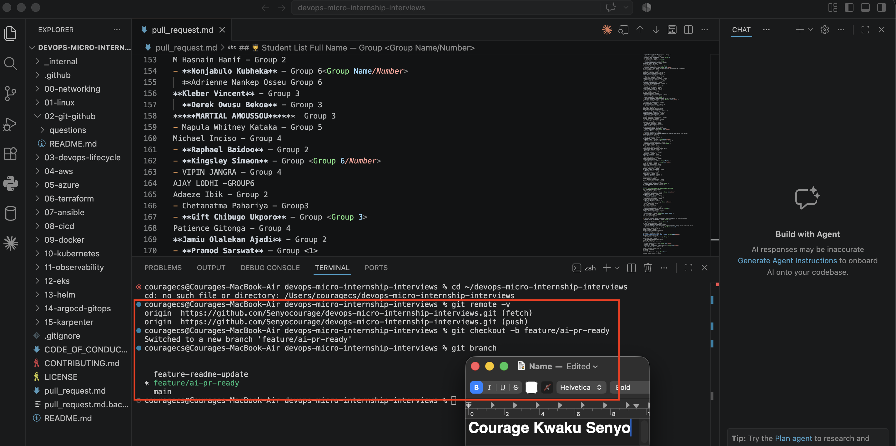
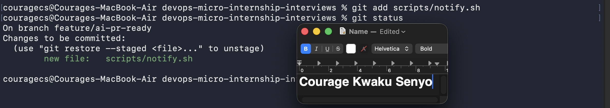
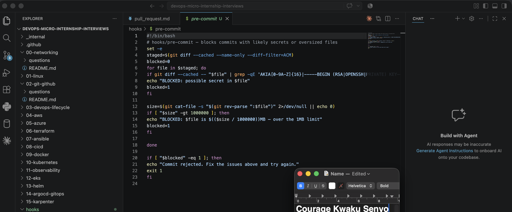
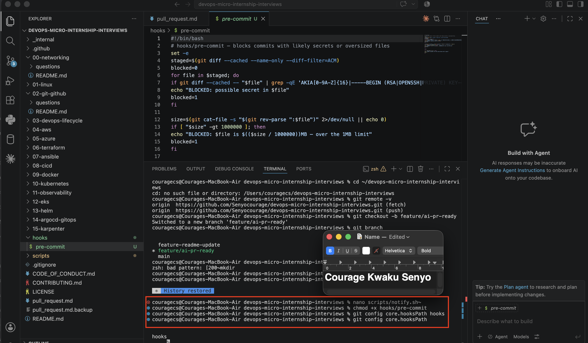
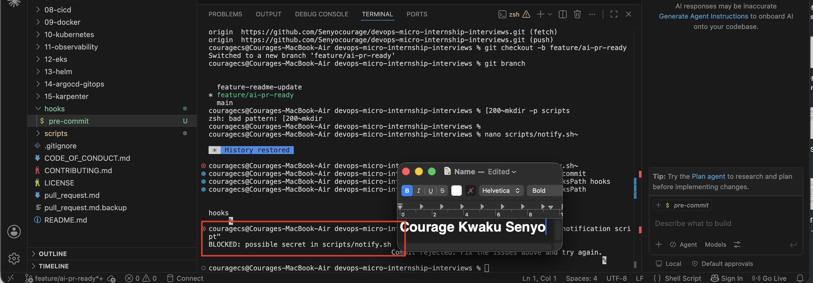
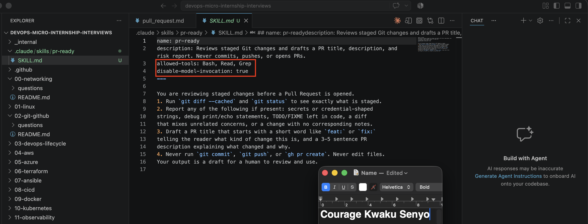
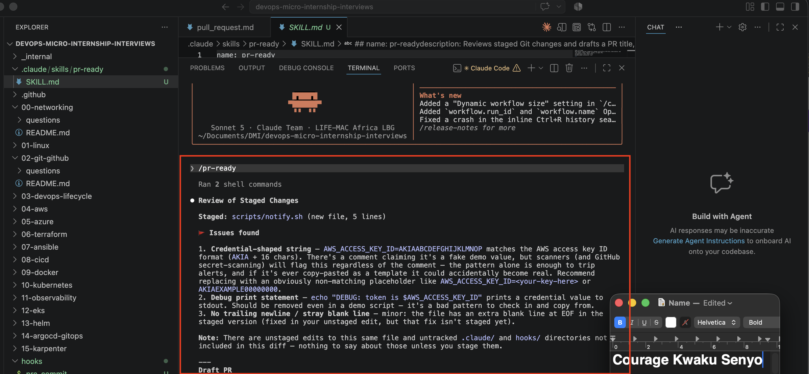
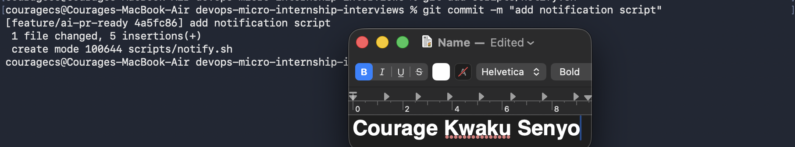
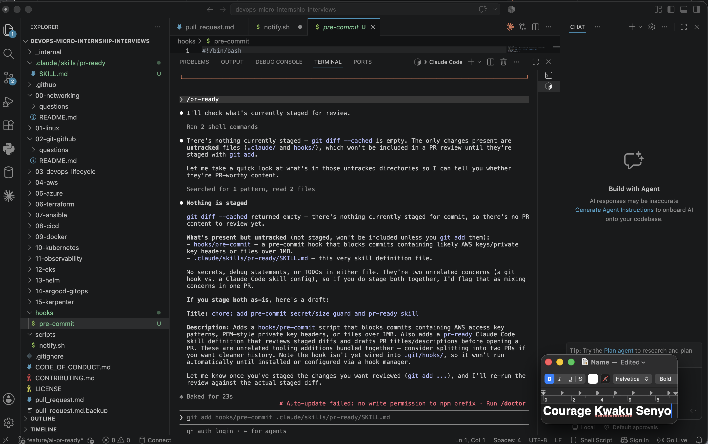
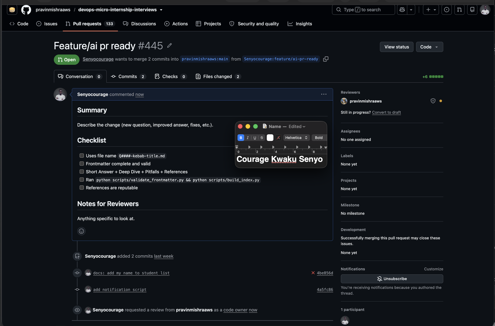

# Assignment 6 — Building an AI-Assisted Git Safety Net (PR Ready Check)

Part of the DevOps Micro Internship (DMI) Cohort 3 with Agentic AI

---

## Purpose

In Week 2 you built Claude Code hooks that block a dangerous action *before* it happens (`PreToolUse`), and a restricted skill that could look but not touch (`allowed-tools` without `Write`). In this assignment you will discover that Git has the exact same idea, decades older: a **pre-commit hook** that blocks a commit before it's created.

You will build both halves of a real "PR Ready" workflow:

1. A **Git hook that follows fixed rules** — scans staged changes for hardcoded secrets and oversized files and refuses the commit. No AI involved, no guessing, just a rule that gives the same answer every time.
2. A **restricted Claude Code skill** (`/pr-ready`) that reads your staged diff and drafts a Pull Request title, description, and a short list of things worth a second look — the kind of judgment a fixed rule can't make (mixed changes, missing context, unclear intent). The skill never commits, pushes, or opens the PR. You do that yourself, using its draft as a starting point.

This mirrors the Agentic Loop from Week 3's Linux triage assignment: **Gather → Analyze → Human Act → Verify**. The hook and the skill both gather and analyze; only you act.

---

# Task 0 — Confirm Your Fork and Create a Feature Branch

## Goal

Confirm you are working in your own fork, then create a dedicated branch for this assignment.

### Evidence

#### Screenshot 1 — Output of git remote -v and git branch showing the new branch

---

### Notes

**1. Why create a dedicated branch instead of doing this work on main?**

A dedicated branch lets me work on new changes without affecting the main branch. It gives me a safe space to test, make updates, and fix mistakes before merging my work. It also makes collaboration easier because the changes can be reviewed through a Pull Request before becoming part of the main project.

---

# Task 1 — Stage a Change With Realistic Risk

## Goal

On your own fork of this repository (the one you've been submitting your DMI work in since onboarding), create a new branch and stage a change that a real reviewer should catch: a hardcoded-looking secret and a leftover debug statement.

### Evidence

#### Screenshot 1 — Output of  `git status` showing the staged file on feature/ai-pr-ready

---

### Notes

**1. Why does this assignment use an obviously fake key instead of a real one?**

The assignment uses a fake AWS key so we can safely practice finding security issues without exposing real credentials. If a real key were accidentally uploaded to GitHub, it could be misused. Using a fake key helps us test our security checks while following good security practices.

---

# Task 2 — Write a Real Git Pre-Commit Hook

## Goal

Create a tracked, shareable pre-commit hook that blocks a commit containing secret-like patterns or files over 1MB.

### Evidence

#### Screenshot 2 — `hooks/pre-commit` open in VS Code showing the full script

---

#### Screenshot 3 — Output of `git config core.hooksPath` confirming it points to `hooks`

---

### Notes

**1. Why is `hooks/pre-commit` tracked in the repo instead of living only in `.git/hooks/`?**

The hooks/pre-commit file is stored in the repository so everyone working on the project can use the same Git hook. Since the .git/hooks/ folder is only available on your local machine and isn't shared when someone clones the repository, keeping the hook in the project makes it easier for the whole team to use the same safety checks.

---

**2. Compare this to `PreToolUse` from Week 2 Assignment 6. What does each one intercept, and what do they have in common?**

A Git pre-commit hook checks changes just before a commit is created and can stop the commit if it finds problems like secrets or large files. PreToolUse checks a tool request before the AI runs it and can allow or block the action. Both work as safety checks that inspect an action before it happens to help prevent mistakes.

---

# Task 3 — Prove the Hook Blocks the Risky Commit

## Goal

Attempt to commit the staged file from Task 1 and show the hook rejecting it.

### Evidence

#### Screenshot 4 — Terminal showing `git commit` rejected with the hook's "BLOCKED" message naming the exact file

---

### Notes

**1. Which line in `hooks/pre-commit` matched your fake key, and why did it match?**

The part AKIA[0-9A-Z]{16} matched the fake AWS key because it started with AKIA followed by 16 uppercase letters, which is the pattern the hook is designed to detect. Since the hook checks staged changes before a commit, it recognized the fake key and blocked the commit.

---

**2. Could this hook have caught a poorly-named variable that stores a secret without the `AKIA` prefix? What does that tell you about the limits of a fixed rule like this?**

No. If a secret does not match the patterns defined in the hook, it may not be detected. For example, a password or token stored in a variable without the AKIA prefix could pass the check. This shows that fixed-rule hooks are useful for catching known patterns, but they cannot detect every type of secret or understand the context. That's why they work best when combined with AI-assisted reviews and human inspection.

---

# Task 4 — Build the `/pr-ready` Skill

## Goal

Create a manually invoked Claude Code skill that reads your staged changes and produces a PR-readiness report and a draft PR description — without writing, committing, or pushing anything itself.

### Evidence

#### Screenshot 5 — `SKILL.md` frontmatter showing `allowed-tools: Bash, Read, Grep` (no `Write`) and `disable-model-invocation: true`

---

#### Screenshot 6 — `/pr-ready` output while the risky file is still staged, showing it flagged the secret and/or debug statement

---

### Notes

**1. Why does `/pr-ready` have `Bash` and `Read` but not `Write`?**

/pr-ready is given Bash and Read permissions so it can inspect the repository and review staged changes. Bash lets it run Git commands like git diff --cached, while Read allows it to examine the files. It does not have Write permission because it is only meant to review and suggest improvements, not make changes. This keeps the developer in control of editing files, committing changes, and creating Pull Requests.

---

**2. The pre-commit hook and `/pr-ready` both looked at the same staged diff. Did they flag the same things? What did one catch that the other didn't?**

Both the pre-commit hook and /pr-ready detected the fake AWS access key in the staged changes. However, they served different purposes. The pre-commit hook followed fixed rules and blocked the commit as soon as it found the matching secret pattern. On the other hand, /pr-ready provided a more detailed review by explaining the security risk, identifying the leftover debug statement, and suggesting improvements before creating a Pull Request. The hook enforced the rules, while the AI gave additional context and review recommendations.

---

# Task 5 — Fix the Issues and Re-Verify

## Goal

Remove the secret and debug statement, then prove both gates now pass clean.

### Evidence

#### Screenshot 7 — `git commit` succeeding after the fix (no BLOCKED message)

---

#### Screenshot 8 — Second `/pr-ready` run showing a clean risk report and a drafted PR title + description

---

### Notes

**1. What exactly did you change to satisfy the pre-commit hook?**

I removed the fake AWS access key that triggered the pre-commit hook and deleted the debug statement that exposed it. After staging the updated file, I committed the changes again. Since the secret pattern and debug statement were no longer present, the pre-commit hook passed successfully and the commit was completed.

---

# Task 6 — Push and Open a Pull Request Using the AI Draft

## Goal

Push your branch and open a real Pull Request, using `/pr-ready`'s drafted title and description as your starting point — read it critically and edit before you use it.

**Important:** Open this Pull Request with base repository set to **your own fork** — not the shared upstream `pravinmishraaws/devops-micro-internship-pravinmishra` repository. This assignment's hook and skill files are your own practice work, not a change meant for the shared class repo.

### Evidence

#### Screenshot 9 — Your Pull Request showing the base repository is your own fork, plus the title and description, with the `/pr-ready` draft visible for comparison (paste it in the PR conversation or your notes below)

---

#### PR Link

https://github.com/pravinmishraaws/devops-micro-internship-interviews/pull/445

---

### Notes

**1. What, if anything, did you edit in the AI's drafted PR description before using it? Why?**

I reviewed and improved the AI-generated PR description to make sure it covered all the work completed in the Pull Request. The first draft focused mostly on the script changes but missed important parts like the hooks/pre-commit file, the /pr-ready Claude Code skill, and the testing process. I updated the description so it clearly explained the complete set of changes included in the PR.

---

**2. If you had blindly copy-pasted the AI's draft without reading it, what could go wrong?**

The PR description might not fully describe the actual changes made, which could confuse reviewers or leave out important information. AI-generated content can sometimes miss details or make incorrect assumptions, so it is important to review and adjust the output before sharing it. AI can help create a draft, but the developer is responsible for ensuring the final information is accurate.

---

**3. Why does this PR need to target your own fork instead of the shared upstream repository?**

The Pull Request is created against my own fork because this assignment is for practicing and demonstrating my Git workflow, not for changing the original shared repository. Using my fork keeps my work isolated, prevents accidental changes to the main project, and allows me to test the complete process safely before contributing to larger projects.

---

# Task 7 — Map the Workflow to the Agentic Loop

## Goal

Explain this assignment's workflow using the same Gather → Analyze → Human Act → Verify structure from Week 3.

### Notes

**1. Which step(s) represent Gather?**

The Gather stage involved collecting details about the changes being reviewed. The pre-commit hook checked the staged files for patterns like possible secrets and large files, while /pr-ready gathered information using Git commands such as git diff --cached and git status to understand the current changes.

---

**2. Which step(s) represent Analyze?**

The Analyze stage happened when the pre-commit hook compared the staged changes against predefined security rules and when /pr-ready reviewed the changes to identify possible risks and create a draft Pull Request summary. The hook provided rule-based checking, while the AI skill added more detailed review and context.

---

**3. Which step is Human Act, and why must a human — not Claude — run `git commit`, `git push`, and open the PR?**

The Human Act stage was when I fixed the detected issues, committed the changes, pushed the branch, and created the Pull Request. These actions directly modify the repository and share changes with others, so a human must approve and control them. Claude can assist with suggestions, but the final decisions and Git operations should remain with the developer.

---

**4. Which step is Verify?**

The Verify stage happened after correcting the issues. I confirmed that the commit completed successfully without the hook blocking it, ran /pr-ready again to ensure there were no remaining risks, and checked that the Pull Request contained the correct changes.

---

**5. In one or two sentences: why do you need *both* the fixed-rule pre-commit hook and the AI skill? Isn't one enough?**

Both tools are needed because they solve different problems. The pre-commit hook provides fast and consistent protection against known risks, while the AI skill helps review changes with more context and can identify issues that simple rules may miss. Together, they provide a stronger workflow with automation, AI assistance, and human review.

---

# Task 8 — LinkedIn Post

## Goal

Publish a LinkedIn post summarizing what you built and what you learned about combining fixed-rule safety checks with AI-assisted review.

### Evidence

#### LinkedIn Post URL

https://www.linkedin.com/posts/senyocouragekwaku_dmibypravinmishra-agenticai-claudecode-ugcPost-7488658455482982400-Qf6z/?utm_source=share&utm_medium=member_desktop&rcm=ACoAADn3DX0BJj1PVBzmKTFriaizjpjw6GKyID4

---

## Key Learnings

Add 3-5 bullet points on what you learned this week.

-Learned how to create and use a Git pre-commit hook to detect possible security risks, such as secret-like credentials and large files, before they are committed.
-Gained practical experience building an AI-powered /pr-ready skill that analyzes staged changes, highlights possible issues, and helps prepare Pull Request information without making changes automatically.
-Improved my understanding of the Agentic AI workflow: Gather → Analyze → Human Act → Verify, where AI supports decision-making while humans maintain control over important actions.

---

# Submission Instructions

- Ensure `hooks/pre-commit` and `.claude/skills/pr-ready/SKILL.md` are committed to your GitHub repository
- Add all required screenshots to your submission
- All written answers must be in your own words
- Do not use a real secret or credential anywhere in your submission — the fake key in Task 1 is intentional and must stay clearly fake
- Open your Pull Request against your own fork, not the shared upstream repository
- Push your final changes to your forked repository
- Include your PR link and LinkedIn post URL

---

## GitHub Repository URL

https://github.com/Senyocourage/devops-micro-internship-interviews

`https://github.com/Senyocourage/devops-micro-internship-interviews`

---

# Completion Checklist

- [ ] Branch `feature/ai-pr-ready` created with a staged file containing a fake secret and a debug statement
- [ ] `hooks/pre-commit` created and tracked in the repo (not only in `.git/hooks/`)
- [ ] `core.hooksPath` configured to point at `hooks/`
- [ ] Pre-commit hook shown blocking the risky commit
- [ ] `.claude/skills/pr-ready/SKILL.md` created with correct `allowed-tools` (no `Write`) and `disable-model-invocation: true`
- [ ] `/pr-ready` run against the risky diff and shown flagging issues
- [ ] Risky file fixed; `git commit` succeeds cleanly
- [ ] `/pr-ready` re-run showing a clean report and drafted PR title/description
- [ ] Pull Request opened using the AI draft as a starting point, with your own fork as the base repository (not upstream), PR link included
- [ ] Agentic Loop mapping (Task 7) completed in your own words
- [ ] LinkedIn post published and URL submitted
- [ ] All required screenshots added
- [ ] GitHub repository URL provided

---

## 📌 About DMI & CloudAdvisory

DevOps Micro Internship (DMI) is a project-based DevOps program run by Pravin Mishra (The CloudAdvisory) focused on real-world execution, systems thinking, and career readiness.

It helps learners build strong DevOps foundations with hands-on experience.

---

## 📌 Resources

- 🌐 DMI Official Website: https://pravinmishra.com/dmi  
- 🎓 DevOps for Beginners (Udemy): https://www.udemy.com/course/devops-for-beginners-docker-k8s-cloud-cicd-4-projects/  
- 🎓 Agentic AI DevOps with Claude Code: https://www.udemy.com/course/ultimate-agentic-ai-devops-with-claude-code/  
- 🎓 DevOps with Claude Code: Terraform, EKS, ArgoCD & Helm: https://www.udemy.com/course/devops-with-claude-code-terraform-eks-argocd-helm/  
- ▶️ YouTube Playlist: https://www.youtube.com/playlist?list=PLFeSNDtI4Cho  
- 🔗 Pravin Mishra (LinkedIn): https://www.linkedin.com/in/pravin-mishra-aws-trainer/  
- 🏢 CloudAdvisory (LinkedIn): https://www.linkedin.com/company/thecloudadvisory/

---

*This submission is part of DevOps Micro Internship (DMI) Cohort 3 — Agentic AI Track.*
