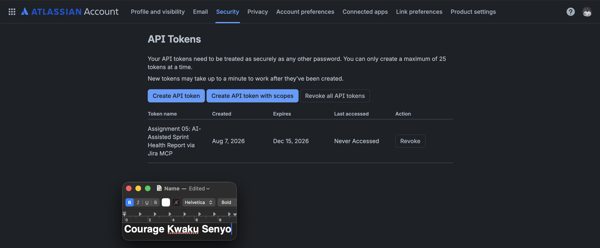
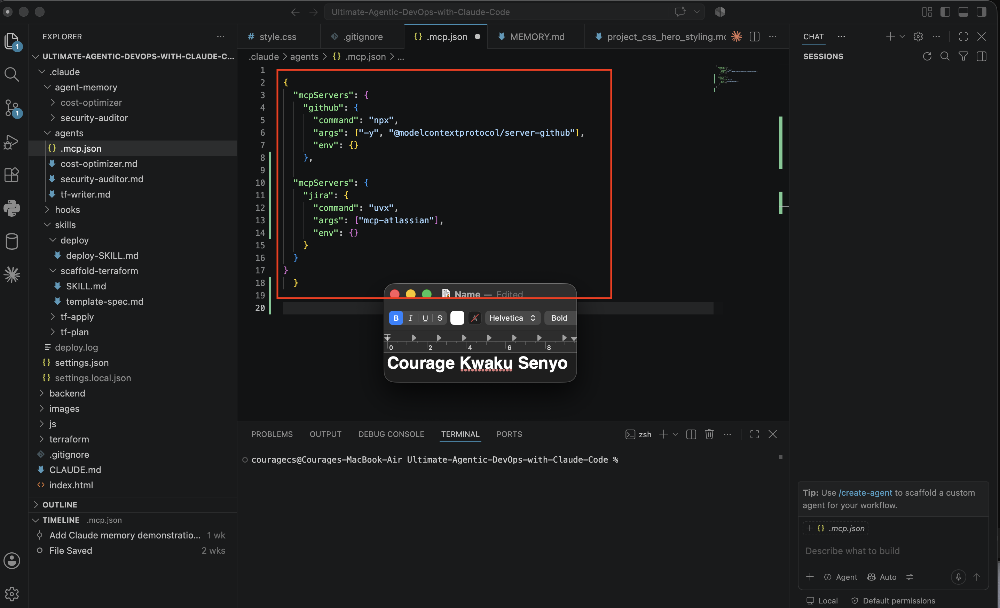
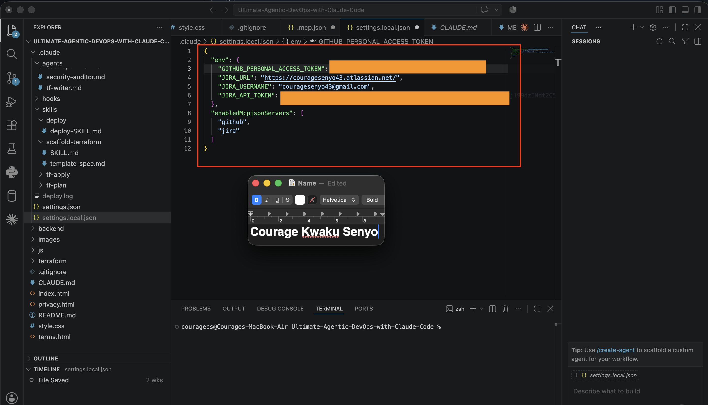
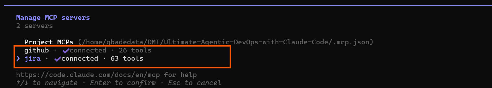
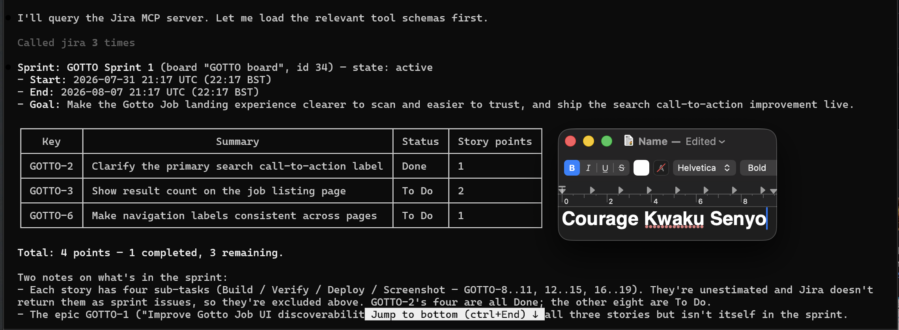
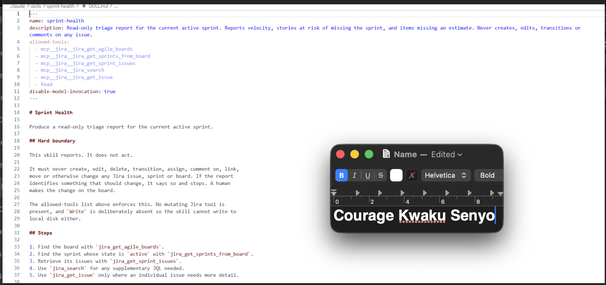
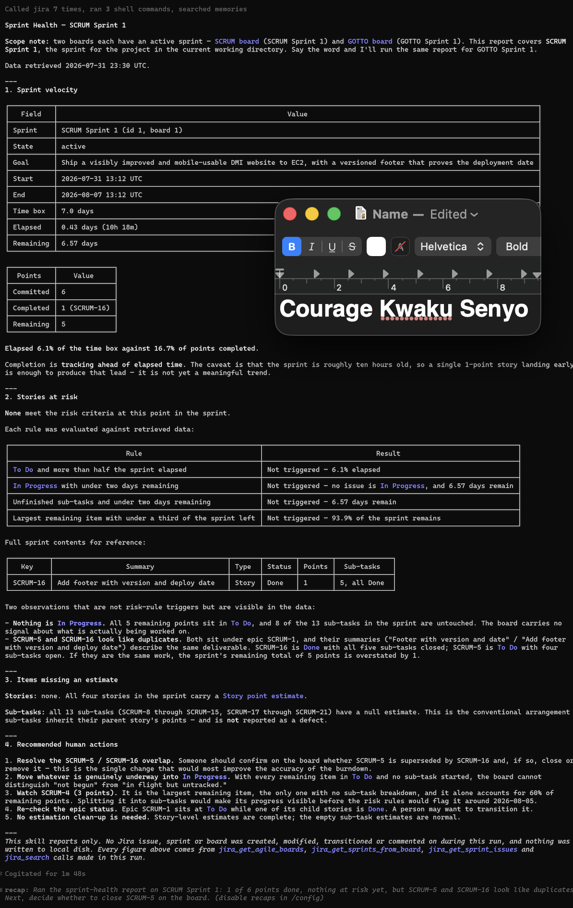
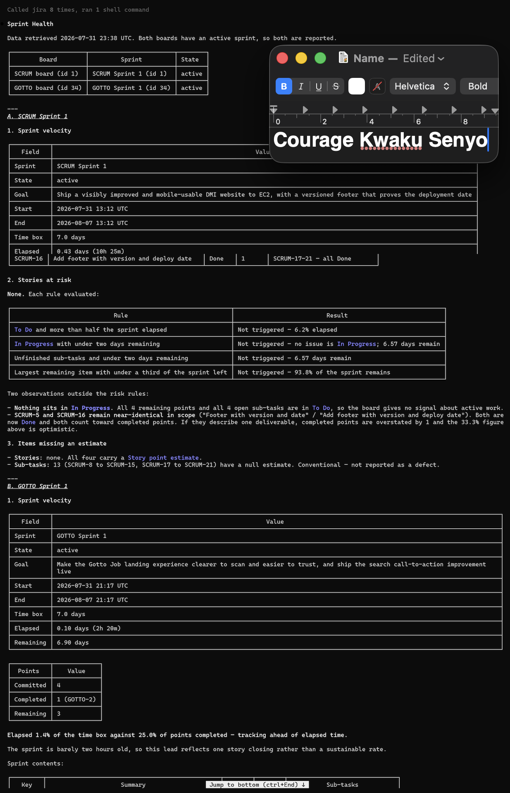

# Assignment 5 — AI-Assisted Sprint Health Report via Jira MCP

Part of the DevOps Micro Internship (DMI) Cohort 3 with Agentic AI

---

## Purpose

In this assignment, you will connect Claude Code to your Jira board through an MCP server, the same way you connected it to GitHub in Week 2, and build a read-only `/sprint-health` skill. The skill reads your current sprint through Jira's API and reports sprint velocity, stories at risk of missing the sprint, and items missing an estimate — but it must never create, edit, comment on, or transition a single ticket itself. You will prove that boundary holds by making a real change on the board yourself and confirming the skill only ever reports, never acts.

---

# Task 1 — Create a Jira API Token

## Goal

Generate an API token from your Atlassian account that the MCP server will use to authenticate with your Jira site. Do not screenshot the token value itself.

### Evidence

#### Screenshot 1 — Jira API token creation confirmation page showing the token name, with the token value not visible

### Notes You Must Write (Very Important):

Why does the MCP server need your site URL and account email in addition to the token?

The Jira email, API token, and Jira URL are all required to connect to Jira successfully.

The email and API token work together for authentication. The email acts as the username, while the API token acts as the password.

The Jira URL is also important because it tells the system which Jira site to access. The token itself does not contain the site information.

I confirmed this by testing the connection directly using the email and API token with:

{JIRA_URL}/rest/api/3/myself

The request worked and returned my Jira account details. This confirmed that the email, API token, and Jira URL are all necessary for the connection to work.

---

# Task 2 — Create .mcp.json at the Project Root

## Goal

Create or update `.mcp.json` at your project root with a Jira MCP server block, following the same shape as the GitHub MCP server you configured in Week 2.

### Evidence

#### Screenshot 2 — `.mcp.json` open in VS Code showing the Jira server configuration

### Notes You Must Write (Very Important):

Compare this jira block to the github block from Week 2 Assignment 5. The GitHub server ran via npx (a Node.js package); this one runs via uvx (a Python package) — what stays exactly the same shape despite that difference, and why doesn't Claude Code care which language a given MCP server is written in?

The GitHub and Jira MCP configurations have the same structure. Both contain three main parts:

command
args
env

The main difference is the command and arguments used to start each server.

GitHub uses npx to run a Node.js package.
Jira uses uvx to run a Python package.

Claude Code does not need to know which programming language the server uses. It simply starts the server and communicates with it through the MCP protocol using standard input and output.

This is the benefit of using a protocol: different technologies can communicate in the same way. That is why both GitHub and Jira appear as MCP servers in /mcp, even though one uses Node.js and the other uses Python.

---

# Task 3 — Add Your Credentials to settings.local.json

## Goal

Add your Jira site URL, account email, and API token to `.claude/settings.local.json`, and confirm that file is listed in `.gitignore` so it is never committed.

### Evidence

#### Screenshot 3 — `settings.local.json` open in VS Code showing the `env` section, with the actual token value blurred or covered

### Notes You Must Write (Very Important):

Why must JIRA_API_TOKEN live in settings.local.json and never in .mcp.json?

.mcp.json is committed to the repository because it contains the shared MCP server configuration. Anyone who clones the project can use it to understand how the servers are set up.
.claude/settings.local.json is kept local and added to .gitignore because it can contain personal credentials such as API tokens.

I verified that the local settings file is ignored using git check-ignore -v and confirmed with git ls-files that it was not being tracked.

The main reason for separating them is security and sharing. API tokens belong to individual users, not the project. Each person should provide their own credentials instead of storing them in a shared repository.

It is also important because once a secret is committed to Git, removing it later does not remove it from the repository history. The safest solution is to keep secrets out of Git and revoke any token that has already been exposed.

---

# Task 4 — Verify the Connection with /mcp

## Goal

Restart Claude Code and confirm the Jira MCP server shows as connected.

### Evidence

#### Screenshot 4 — `/mcp` output showing `jira: connected`

---

# Task 5 — Run a Live Query to Prove Real Board Data

## Goal

Ask Claude to list the issues in your current active sprint through the Jira MCP connection, and confirm the result matches what you see on your live board in the browser.

### Evidence

#### Screenshot 5 — Claude's response showing the live sprint issue list retrieved via Jira MCP

### Notes You Must Write (Very Important):

How did you confirm this was real board data and not something Claude guessed?

I verified it in three ways, from the easiest to the strongest proof.

First, I checked for information that could not be guessed from the conversation, such as the internal board ID (34), the exact sprint start time (2026-07-31 21:17 UTC), and the sub-task key range (GOTTO-8 to GOTTO-19). These details are only available from the actual Jira data.

Second, I compared the generated report with the Jira board in the browser. The issue keys, statuses, story points, and sub-task counts matched correctly.

Third, I made a change directly in Jira and ran the skill again. The new report detected the update automatically, showed the new resolution time (23:36 UTC), and updated the completed story points from 1 to 2.

This confirmed that the report was using real Jira data and not simply generating answers based on previous context.

---

# Task 6 — Build the /sprint-health Skill

## Goal

Create a `/sprint-health` skill restricted to read-only Jira tools plus `Read`, with no issue-mutating tools and no `Write`. Run it and confirm it produces a report covering sprint velocity, at-risk stories, and items missing an estimate.

### Evidence

#### Screenshot 6 — `SKILL.md` frontmatter showing `allowed-tools` limited to read-only Jira tools plus `Read`, with `disable-model-invocation: true`

#### Screenshot 7 — `/sprint-health` output showing the full triage report against your real sprint

### Notes You Must Write (Very Important):

1. Which Jira MCP tools does this skill's allowed-tools list include, and which mutating tools (create issue, update issue, transition issue, add comment) does it deliberately exclude?

The skill only allows read-only Jira tools plus the Read permission. The allowed Jira tools are:

mcp__jira__jira_get_agile_boards – to find the Jira board
mcp__jira__jira_get_sprints_from_board – to identify the active sprint
mcp__jira__jira_get_sprint_issues – to retrieve sprint issues
mcp__jira__jira_search – to run additional JQL searches
mcp__jira__jira_get_issue – to view details of specific issues

It intentionally excludes all tools that can modify Jira data, such as:

Creating issues
Updating issues
Moving issues
Changing issue status
Adding comments
Assigning issues
Creating or updating sprints

Examples of excluded tools include:

jira_create_issue
jira_update_issue
jira_transition_issue
jira_add_comment
jira_delete_issue
jira_assign_issue

Two exclusions required extra consideration:

jira_download_attachments is technically read-only in Jira, but it writes files to the local machine, so it was excluded to maintain a strict read-only boundary.
jira_get_transitions does not change anything, but it was excluded because the skill does not need transition information since it will never perform status changes.

2. Why does a Scrum Master need this restriction more than almost any other role in this course?

A Scrum Master needs this restriction because their responsibility is to observe, support, and improve the process, not to change the team's work records.

The Product Owner manages priorities, and developers build the product. The Scrum Master helps the team follow Scrum practices and ensures that progress is transparent. The Jira board should represent the team's actual work, not changes made by the Scrum Master.

If a Scrum Master has permission to modify tickets, it can create problems. For example, they might move tasks to Done simply to keep the board clean, but this could make the progress report inaccurate. The burndown chart, velocity, and sprint metrics would no longer reflect the real situation.

A good example from this assignment was when the report identified that SCRUM-5 and SCRUM-16 represented similar footer work. The skill only reported the overlap and suggested a solution. It did not close or modify the issue automatically. The final decision remained with the person responsible for confirming that the work was actually completed.

This keeps Jira accurate, transparent, and aligned with Scrum principles.

---

# Task 7 — Prove the Skill Never Mutates the Board

## Goal

Manually update one ticket on your board in the browser (for example, move a story to "Done" or add a missing estimate), then run `/sprint-health` again and confirm the new report reflects your change — proving the skill only ever reads live state and never wrote to the board itself.

### Evidence

#### Screenshot 8 — Second `/sprint-health` run showing the report now reflects your manual board change

### Notes You Must Write (Very Important):

Map this assignment to Gather → Analyze → Human Act → Verify from Week 3 Assignment 6. Which step did you perform manually in the browser, and why must that step stay human?

Mapping the Assignment to Gather → Analyze → Human Act → Verify

Gather:
The skill collected Jira information using read-only tools, including the board details, active sprint, issues, and sub-tasks. At this stage, it only gathered data without making any decisions or changes.

Analyze:
The skill reviewed the collected data by calculating sprint progress, checking completed story points, identifying risks, and highlighting issues such as missing estimates or duplicate-looking stories. It also identified that SCRUM-5 and SCRUM-16 appeared to represent the same footer task, which required further human review.

Human Act:
I manually opened SCRUM-5 in Jira and moved it to Done, including updating its four sub-tasks. This step was done manually because the skill does not have permission to modify Jira issues.

Verify:
After the update, I ran the skill again. It detected the change automatically, recorded the updated resolution time (23:36 UTC), updated completed points from 1 to 2, and adjusted the report based on the new Jira state.

Why the Human Act Must Stay Manual

The final decision requires human judgement. The skill can identify possible problems, such as duplicate stories, but it cannot fully understand the context behind the work.

In this case, the skill noticed that two stories looked similar, but only a person could confirm whether they were actually duplicates or had different requirements.

Keeping the action manual prevents incorrect updates to Jira. A wrong analysis only affects a report and can be reviewed, but a wrong change can affect the entire project record, including burndown charts, velocity calculations, and future sprint planning.

The key idea is: automation can help collect and analyze information, but important decisions that change the source of truth should remain with humans.

---

# Submission Instructions

Complete all tasks in sequence.

Your submission must include:
- All 8 required screenshots
- All the required notes

---

# Completion Checklist

- [ ] Task 1: Jira API token created, value never screenshotted (Screenshot 1)
- [ ] Task 2: `.mcp.json` has the Jira server block (Screenshot 2)
- [ ] Task 3: Credentials stored in `settings.local.json`, token blurred, file gitignored (Screenshot 3)
- [ ] Task 4: `/mcp` shows the Jira server connected (Screenshot 4)
- [ ] Task 5: Live query returned real sprint data, verified against the browser (Screenshot 5)
- [ ] Task 6: `/sprint-health` skill created with correct read-only `allowed-tools`, and produced a full report (Screenshots 6–7)
- [ ] Task 7: A manual board change was reflected in a second `/sprint-health` run (Screenshot 8)
- [ ] Skill never created, edited, transitioned, or commented on any issue
- [ ] Reflection answered (Notes)
- [ ] No API token value exposed

---

## 📌 About DMI & CloudAdvisory

DevOps Micro Internship (DMI) is a project-based DevOps program run by Pravin Mishra (The CloudAdvisory) focused on real-world execution, systems thinking, and career readiness.

It helps learners build strong DevOps foundations with hands-on experience.

---

## 📌 Resources

- 🌐 DMI Official Website: https://dmi.pravinmishra.com?utm_source=github&utm_medium=readme  
- 🎓 University: https://university.pravinmishra.com?utm_source=github&utm_medium=readme  
- 💬 Discord Community: https://discord.pravinmishra.com?utm_source=github&utm_medium=readme  
- 📝 Blog: https://dmi.pravinmishra.com/blog?utm_source=github&utm_medium=readme  
- ▶️ YouTube Playlist: https://www.youtube.com/playlist?list=PLFeSNDtI4Cho  
- 🔗 Pravin Mishra (LinkedIn): https://www.linkedin.com/in/pravin-mishra-aws-trainer/  
- 🏢 CloudAdvisory (LinkedIn): https://www.linkedin.com/company/thecloudadvisory/

---

*This submission is part of DevOps Micro Internship (DMI) Cohort 3 — Agentic AI Track.*
